# Java基礎 Vol.07 配列 - フローチャートとトレース表

この資料は、`src/` 配下のすべての Java ファイルに対応するフローチャートとトレース表です。
パッケージ宣言はなく、すべてデフォルトパッケージです。

## 読み方

- コンパイルできるファイルは、実行時の制御の流れをフローチャートにしています。
- コンパイルエラー確認用ファイルは、コンパイル時にどこで止まるかをフローチャートと表にしています。
- 実行時例外確認用ファイルは、例外が発生する直前までの値の変化を表にしています。
- 配列参照の値は JVM の実行ごとに変わるため、`[I@...` のように省略しています。

---

## App

- 対象ファイル: `src/App.java`
- テーマ: 最小の出力プログラム。

### ソースの要点

```java
System.out.println("Hello, World!");
```

### フローチャート

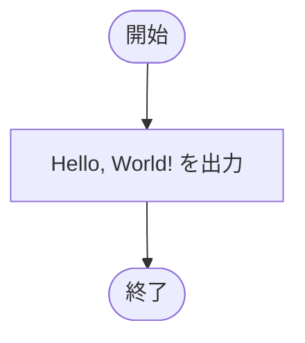

### トレース表

| ステップ | 処理 | 出力 | コメント |
|----|----|----|----|
| 1 | `println` を実行 | `Hello, World!` | 文字列を表示する |
| 2 | 終了 | （なし） | `main` が終了 |

### 実行結果（標準出力）

```text
Hello, World!
```

### 学習ポイント

- `System.out.println` は出力後に改行する。

---

## SampleArray01a

- 対象ファイル: `src/SampleArray01a.java`
- テーマ: 配列変数の宣言。

### ソースの要点

```java
byte[] arrayByte;
int[] arrayInt;
String[] arrayString;
```

### フローチャート

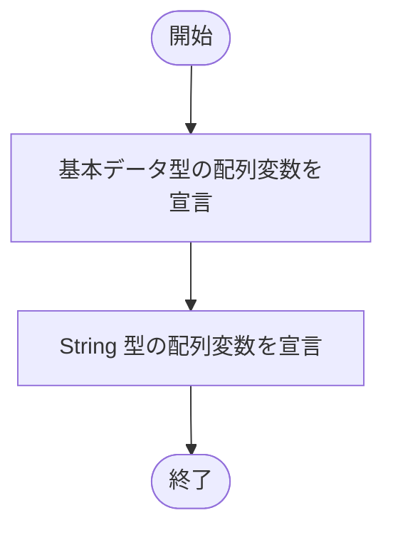

### トレース表

| ステップ | 宣言 | 値 | 出力 | コメント |
|----|----|----|----|----|
| 1 | `byte[]` など | 未代入 | （なし） | 宣言だけで配列は作らない |
| 2 | `String[]` | 未代入 | （なし） | 参照型配列の変数を宣言 |
| 3 | 終了 | - | （なし） | 変数は使用していない |

### 実行結果（標準出力）

```text
（出力なし）
```

### 学習ポイント

- 配列変数の宣言と配列インスタンスの生成は別の処理。

---

## SampleArray01b

- 対象ファイル: `src/SampleArray01b.java`
- テーマ: 未初期化のローカル変数を使った場合のコンパイルエラー。

### ソースの要点

```java
int[] array;
System.out.println(array);
```

### フローチャート

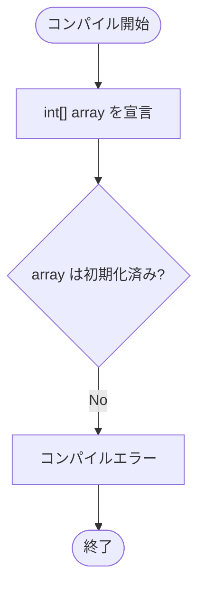

### トレース表

| ステップ | array | 処理 | 結果 | コメント |
|----|----|----|----|----|
| 1 | 未初期化 | 配列変数を宣言 | 成功 | ローカル変数は初期値を持たない |
| 2 | 未初期化 | `println(array)` | コンパイルエラー | 初期化前の変数は使えない |

### 実行結果

```text
コンパイルエラー: 変数arrayは初期化されていない可能性があります
```

### 学習ポイント

- ローカル変数は、使用前に必ず値を代入する必要がある。

---

## SampleArray02a

- 対象ファイル: `src/SampleArray02a.java`
- テーマ: 配列の生成、要素への代入、要素の表示。

### ソースの要点

```java
int[] ai;
ai = new int[3];
ai[2] = 777;
System.out.println(ai[2]);
```

### フローチャート

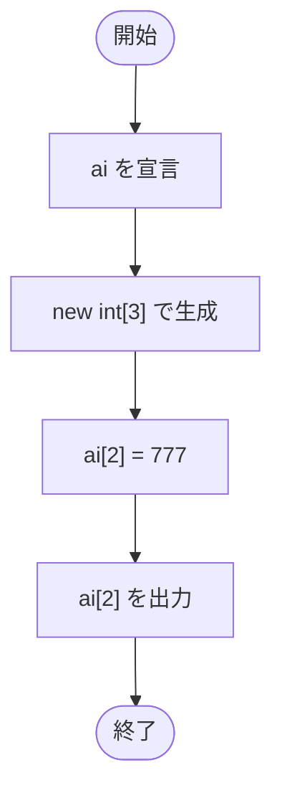

### トレース表

| ステップ | ai[0] | ai[1] | ai[2] | 出力 | コメント |
|----|----|----|----|----|----|
| 1 | - | - | - | （なし） | `ai` を宣言 |
| 2 | 0 | 0 | 0 | （なし） | `new int[3]` で初期値はすべて `0` |
| 3 | 0 | 0 | 777 | （なし） | 3 番目の要素へ代入 |
| 4 | 0 | 0 | 777 | `777` | `ai[2]` を表示 |

### 実行結果（標準出力）

```text
777
```

### 学習ポイント

- 長さ 3 の配列で使える添字は `0`, `1`, `2`。

---

## SampleArray02b

- 対象ファイル: `src/SampleArray02b.java`
- テーマ: 配列生成直後の初期値。

### ソースの要点

```java
byte[] arrayByte = new byte[3];
boolean[] arrayBoolean = new boolean[3];
String[] arrayString = new String[3];
System.out.println(arrayByte[0]);
```

### フローチャート

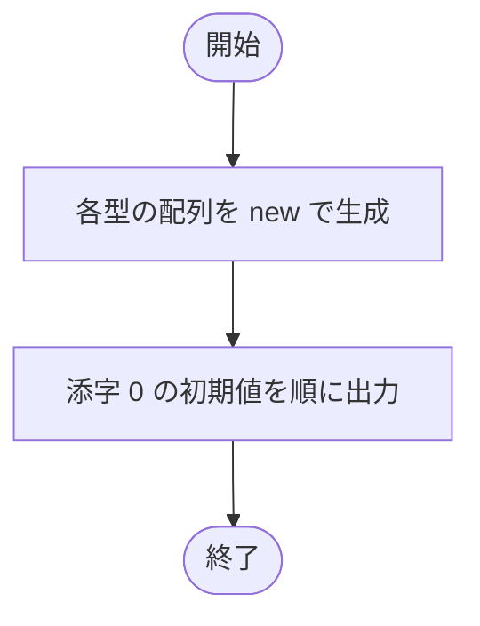

### トレース表

| ステップ | 配列 | 添字 | 初期値 | 出力の要点 | コメント |
|----|----|----|----|----|----|
| 1 | 整数型配列 | 0 | `0` | `0` | `byte`, `short`, `int`, `long` |
| 2 | 小数型配列 | 0 | `0.0` | `0.0` | `float`, `double` |
| 3 | `char[]` | 0 | `\u0000` | 空文字のように見える | ヌル文字 |
| 4 | `boolean[]` | 0 | `false` | `false` | 真偽値の初期値 |
| 5 | `String[]` | 0 | `null` | `null` | 参照型の初期値 |

### 実行結果（標準出力）

```text
byte型配列   :0
short型配列   :0
int型配列   :0
long型配列   :0
float型配列   :0.0
double型配列   :0.0
char型配列   :
boolean型配列   :false
String型配列   :null
```

### 学習ポイント

- 配列の要素には型ごとの初期値が入る。

---

## SampleArray02c

- 対象ファイル: `src/SampleArray02c.java`
- テーマ: 負の要素数で配列を生成した場合の実行時例外。

### ソースの要点

```java
byte[] array;
array = new byte[-1];
```

### フローチャート

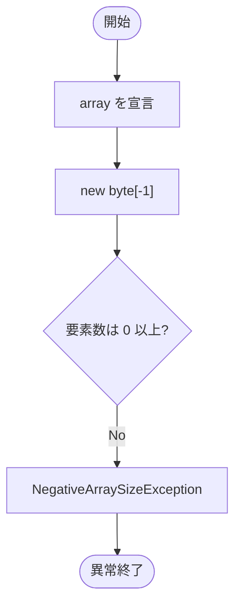

### トレース表

| ステップ | 要素数 | 処理 | 結果 | コメント |
|----|----|----|----|----|
| 1 | - | `array` を宣言 | 成功 | まだ配列はない |
| 2 | `-1` | 配列生成 | 例外 | 要素数が負のため失敗 |

### 実行結果

```text
java.lang.NegativeArraySizeException: -1
```

### 学習ポイント

- 配列の要素数に負の値は指定できない。

---

## SampleArray02d

- 対象ファイル: `src/SampleArray02d.java`
- テーマ: 配列の要素数に `double` を指定した場合のコンパイルエラー。

### ソースの要点

```java
short[] array;
array = new short[1.1];
```

### フローチャート

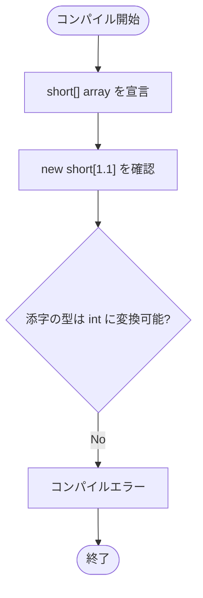

### トレース表

| ステップ | 指定値 | 処理 | 結果 | コメント |
|----|----|----|----|----|
| 1 | - | 配列変数を宣言 | 成功 | 宣言は正しい |
| 2 | `1.1` | 配列生成式を検査 | コンパイルエラー | `double` は要素数に使えない |

### 実行結果

```text
コンパイルエラー: double から int への変換で精度が失われる可能性があります
```

### 学習ポイント

- 配列の要素数には整数値を指定する。

---

## SampleArray02e

- 対象ファイル: `src/SampleArray02e.java`
- テーマ: 配列の要素数に `long` を指定した場合のコンパイルエラー。

### ソースの要点

```java
boolean[] array;
array = new boolean[1L];
```

### フローチャート

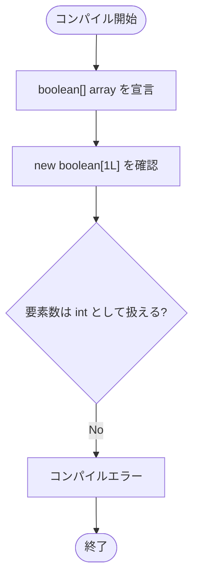

### トレース表

| ステップ | 指定値 | 処理 | 結果 | コメント |
|----|----|----|----|----|
| 1 | - | 配列変数を宣言 | 成功 | 宣言は正しい |
| 2 | `1L` | 配列生成式を検査 | コンパイルエラー | `long` は暗黙に `int` へ変換されない |

### 実行結果

```text
コンパイルエラー: long から int への変換で精度が失われる可能性があります
```

### 学習ポイント

- `1` と `1L` は型が違う。

---

## SampleArray02f

- 対象ファイル: `src/SampleArray02f.java`
- テーマ: 配列の範囲外アクセス。

### ソースの要点

```java
int[] array = new int[3];
System.out.println(array[3]);
```

### フローチャート

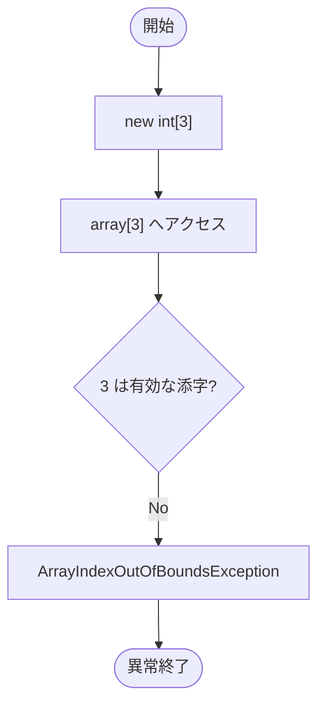

### トレース表

| ステップ | 配列長 | アクセス | 出力 | コメント |
|----|----|----|----|----|
| 1 | 3 | - | （なし） | 有効な添字は `0` から `2` |
| 2 | 3 | `array[3]` | （なし） | 添字が範囲外 |
| 3 | 3 | - | 例外 | 実行時に異常終了 |

### 実行結果

```text
java.lang.ArrayIndexOutOfBoundsException: Index 3 out of bounds for length 3
```

### 学習ポイント

- 添字の最大値は `length - 1`。

---

## SampleArray02g

- 対象ファイル: `src/SampleArray02g.java`
- テーマ: `byte[]` を `int[]` へ代入できない例。

### ソースの要点

```java
int[] ai;
ai = new byte[5];
```

### フローチャート

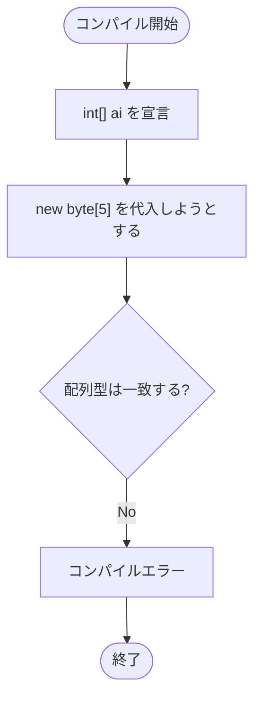

### トレース表

| ステップ | 左辺 | 右辺 | 結果 | コメント |
|----|----|----|----|----|
| 1 | `int[]` | - | 成功 | 宣言のみ |
| 2 | `int[]` | `byte[]` | コンパイルエラー | 要素型が違う配列は代入不可 |

### 実行結果

```text
コンパイルエラー: byte[] を int[] に変換できません
```

### 学習ポイント

- `byte` から `int` への代入が可能でも、`byte[]` から `int[]` への代入はできない。

---

## SampleArray02h

- 対象ファイル: `src/SampleArray02h.java`
- テーマ: `int[]` を `byte[]` へ代入できない例。

### ソースの要点

```java
byte[] ab;
ab = new int[5];
```

### フローチャート

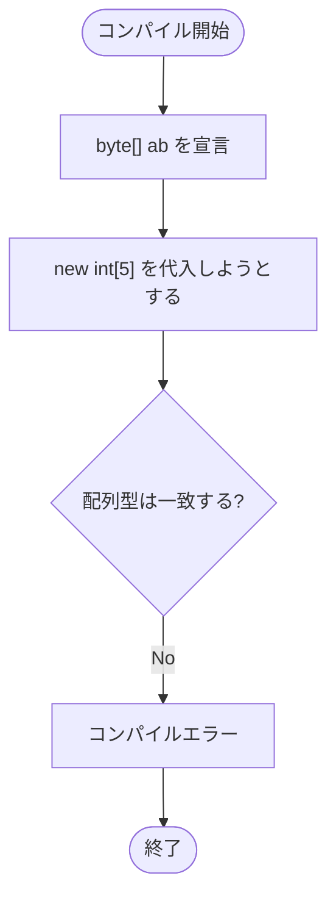

### トレース表

| ステップ | 左辺 | 右辺 | 結果 | コメント |
|----|----|----|----|----|
| 1 | `byte[]` | - | 成功 | 宣言のみ |
| 2 | `byte[]` | `int[]` | コンパイルエラー | 配列型が違う |

### 実行結果

```text
コンパイルエラー: int[] を byte[] に変換できません
```

### 学習ポイント

- 配列どうしの代入は、基本的に配列型の一致が必要。

---

## SampleArray03a

- 対象ファイル: `src/SampleArray03a.java`
- テーマ: 配列要素への代入と表示。

### ソースの要点

```java
int[] ai = new int[5];
ai[0] = 34;
ai[1] = 58;
ai[2] = 7;
ai[3] = 89;
ai[4] = 100;
```

### フローチャート

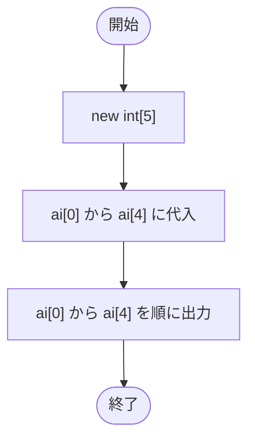

### トレース表

| ステップ | ai[0] | ai[1] | ai[2] | ai[3] | ai[4] | 出力 |
|----|----|----|----|----|----|----|
| 1 | 0 | 0 | 0 | 0 | 0 | （なし） |
| 2 | 34 | 58 | 7 | 89 | 100 | （なし） |
| 3 | 34 | 58 | 7 | 89 | 100 | `ai[0] = 34` から順に表示 |

### 実行結果（標準出力）

```text
ai[0] = 34
ai[1] = 58
ai[2] = 7
ai[3] = 89
ai[4] = 100
```

### 学習ポイント

- 各要素は独立した変数のように代入・参照できる。

---

## SampleArray04a

- 対象ファイル: `src/SampleArray04a.java`
- テーマ: 配列生成後に代入し、通常の `for` 文で表示する。

### ソースの要点

```java
int[] ai;
ai = new int[4];
for (int i = 0; i < 4; i++) {
    System.out.println("ai[" + i + "] = " + ai[i]);
}
```

### フローチャート

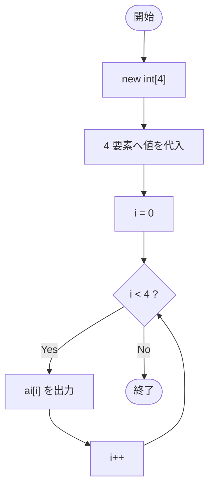

### トレース表

| ステップ | i | 条件 `i < 4` | 出力 | コメント |
|----|----|----|----|----|
| 1 | 0 | true | `ai[0] = 78` | 1 番目 |
| 2 | 1 | true | `ai[1] = 92` | 2 番目 |
| 3 | 2 | true | `ai[2] = 80` | 3 番目 |
| 4 | 3 | true | `ai[3] = 100` | 4 番目 |
| 5 | 4 | false | （なし） | ループ終了 |

### 実行結果（標準出力）

```text
ai[0] = 78
ai[1] = 92
ai[2] = 80
ai[3] = 100
```

### 学習ポイント

- 添字を `for` 文のカウンタで管理できる。

---

## SampleArray04b

- 対象ファイル: `src/SampleArray04b.java`
- テーマ: 宣言と生成を同時に行い、`for` 文で表示する。

### ソースの要点

```java
int[] ai = new int[4];
ai[0] = 78;
...
for (int i = 0; i < 4; i++) {
    System.out.println("ai[" + i + "] = " + ai[i]);
}
```

### フローチャート

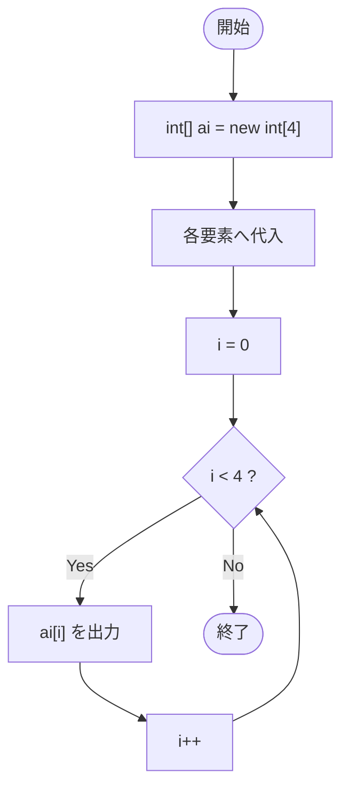

### トレース表

| ステップ | i | ai[i] | 出力 | コメント |
|----|----|----|----|----|
| 1 | 0 | 78 | `ai[0] = 78` | 通常実行 |
| 2 | 1 | 92 | `ai[1] = 92` | 通常実行 |
| 3 | 2 | 80 | `ai[2] = 80` | 通常実行 |
| 4 | 3 | 100 | `ai[3] = 100` | 通常実行 |
| 5 | 4 | - | （なし） | 条件が false |

### 実行結果（標準出力）

```text
ai[0] = 78
ai[1] = 92
ai[2] = 80
ai[3] = 100
```

### 学習ポイント

- `int[] ai = new int[4];` で宣言と生成をまとめられる。

---

## SampleArray04c

- 対象ファイル: `src/SampleArray04c.java`
- テーマ: 配列初期化子と `for` 文。

### ソースの要点

```java
int[] ai = { 78, 92, 80, 100 };
for (int i = 0; i < 4; i++) {
    System.out.println("ai[" + i + "] = " + ai[i]);
}
```

### フローチャート

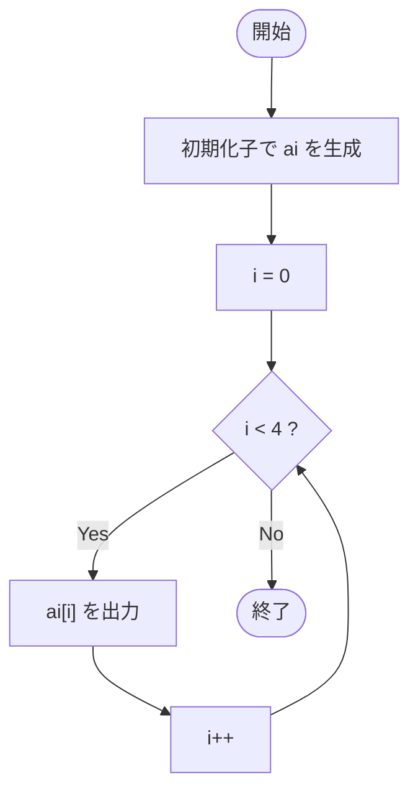

### トレース表

| ステップ | i | 条件 `i < 4` | ai[i] | 出力 |
|----|----|----|----|----|
| 1 | 0 | true | 78 | `ai[0] = 78` |
| 2 | 1 | true | 92 | `ai[1] = 92` |
| 3 | 2 | true | 80 | `ai[2] = 80` |
| 4 | 3 | true | 100 | `ai[3] = 100` |
| 5 | 4 | false | - | （なし） |

### 実行結果（標準出力）

```text
ai[0] = 78
ai[1] = 92
ai[2] = 80
ai[3] = 100
```

### 学習ポイント

- 初期化子を使うと、生成と代入を同時に書ける。

---

## SampleArrayLength01a

- 対象ファイル: `src/SampleArrayLength01a.java`
- テーマ: `length` フィールド。

### ソースの要点

```java
String[] list = { "Tanaka", "Yamada", "Sato", "Kobayashi" };
System.out.println("登録者数：" + list.length + "人");
```

### フローチャート

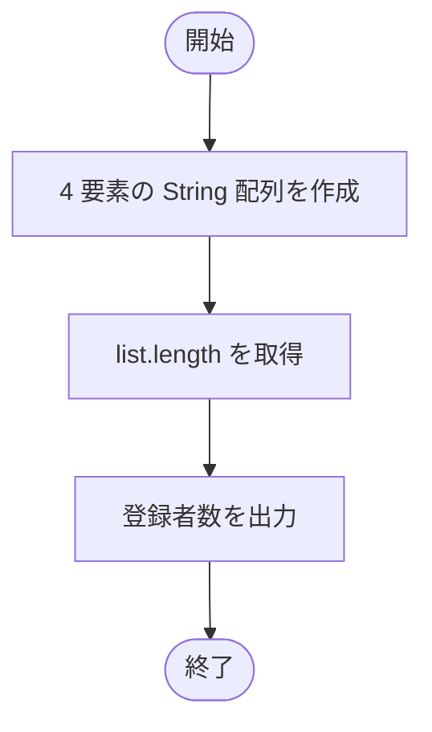

### トレース表

| ステップ | list.length | 出力 | コメント |
|----|----|----|----|
| 1 | 4 | （なし） | 4 人分の配列 |
| 2 | 4 | `登録者数：4人` | `length` を表示 |

### 実行結果（標準出力）

```text
登録者数：4人
```

### 学習ポイント

- 配列の長さは `配列名.length` で取得する。

---

## SampleArrayLength02a

- 対象ファイル: `src/SampleArrayLength02a.java`
- テーマ: 固定値 `3` を使ったループ。

### ソースの要点

```java
int[] score = { 89, 56, 24 };
for (int i = 0; i < 3; i++) {
    System.out.println(score[i]);
}
```

### フローチャート

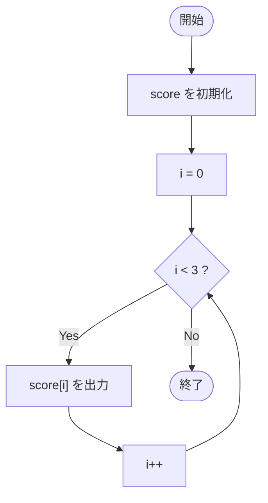

### トレース表

| ステップ | i | 条件 `i < 3` | score[i] | 出力 |
|----|----|----|----|----|
| 1 | 0 | true | 89 | `89` |
| 2 | 1 | true | 56 | `56` |
| 3 | 2 | true | 24 | `24` |
| 4 | 3 | false | - | （なし） |

### 実行結果（標準出力）

```text
89
56
24
```

### 学習ポイント

- 固定値でも動くが、配列長が変わると修正が必要になる。

---

## SampleArrayLength02b

- 対象ファイル: `src/SampleArrayLength02b.java`
- テーマ: `length` を使った安全なループ。

### ソースの要点

```java
for (int i = 0; i < score.length; i++) {
    System.out.println(score[i]);
}
```

### フローチャート

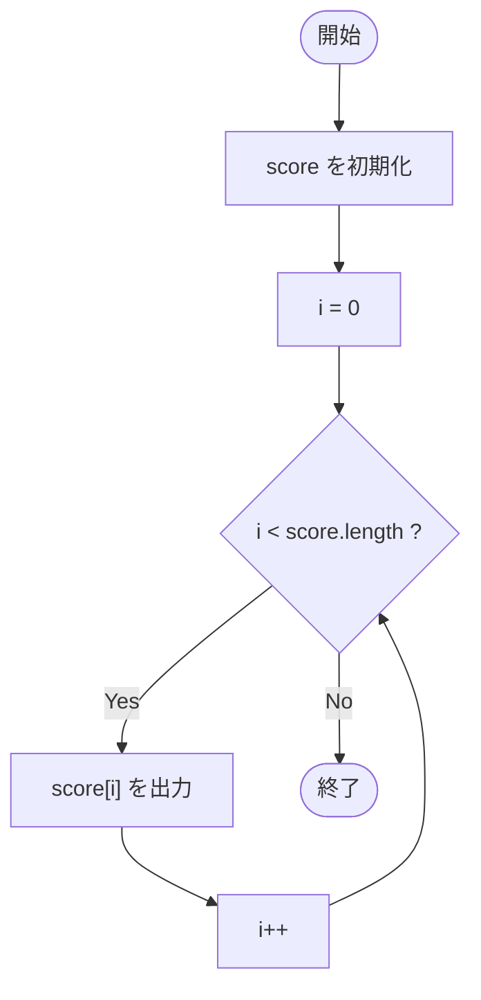

### トレース表

| ステップ | i | score.length | 条件 | 出力 |
|----|----|----|----|----|
| 1 | 0 | 3 | true | `89` |
| 2 | 1 | 3 | true | `56` |
| 3 | 2 | 3 | true | `24` |
| 4 | 3 | 3 | false | （なし） |

### 実行結果（標準出力）

```text
89
56
24
```

### 学習ポイント

- `length` を使うと、配列の要素数が変わってもループを直しにくくて済む。

---

## SampleArrayFor01a

- 対象ファイル: `src/SampleArrayFor01a.java`
- テーマ: 通常の `for` 文で配列を順に表示する。

### ソースの要点

```java
for (int i = 0; i < score.length; i++) {
    System.out.println(score[i]);
}
```

### フローチャート

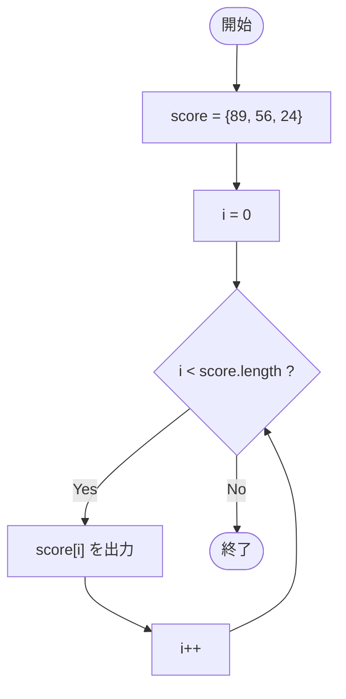

### トレース表

| ステップ | i | score[i] | 出力 | コメント |
|----|----|----|----|----|
| 1 | 0 | 89 | `89` | 添字を使う |
| 2 | 1 | 56 | `56` | 添字を使う |
| 3 | 2 | 24 | `24` | 添字を使う |
| 4 | 3 | - | （なし） | ループ終了 |

### 実行結果（標準出力）

```text
89
56
24
```

### 学習ポイント

- 通常の `for` 文では添字 `i` を使える。

---

## SampleArrayFor01b

- 対象ファイル: `src/SampleArrayFor01b.java`
- テーマ: 拡張 `for` 文で配列を順に表示する。

### ソースの要点

```java
for (int x : score) {
    System.out.println(x);
}
```

### フローチャート

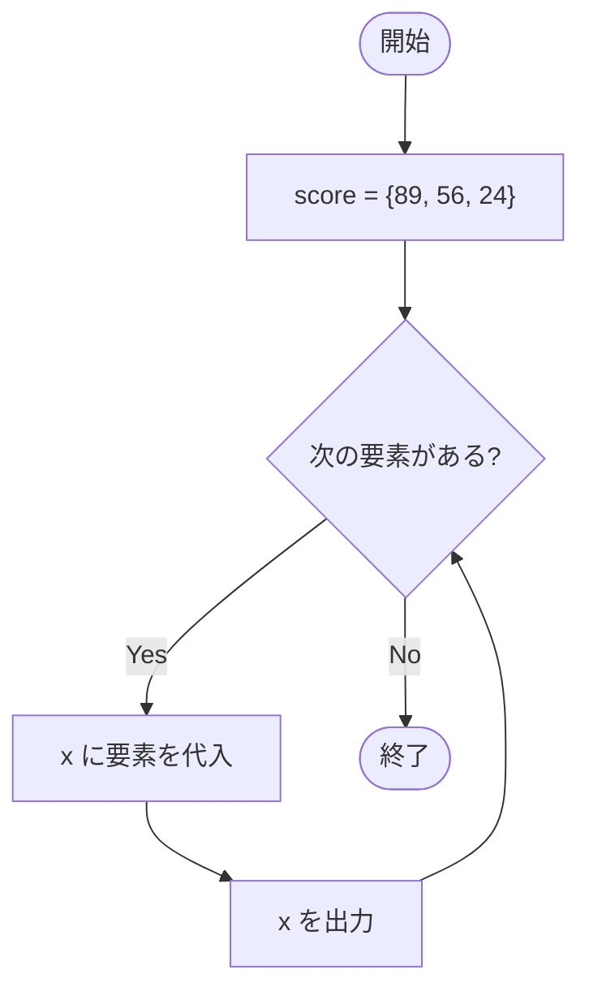

### トレース表

| ステップ | x | 出力 | コメント |
|----|----|----|----|
| 1 | 89 | `89` | 1 番目の要素 |
| 2 | 56 | `56` | 2 番目の要素 |
| 3 | 24 | `24` | 3 番目の要素 |
| 4 | - | （なし） | 要素がなくなり終了 |

### 実行結果（標準出力）

```text
89
56
24
```

### 学習ポイント

- 拡張 `for` 文は、添字が不要な全件処理に向いている。

---

## SampleArrayAsRef01

- 対象ファイル: `src/SampleArrayAsRef01.java`
- テーマ: 異なる基本型配列のキャスト不可。

### ソースの要点

```java
int[] ia = new int[3];
byte[] ib = new byte[3];
ia = (int[]) ib;
```

### フローチャート

```mermaid
flowchart TD
    A([コンパイル開始]) --> B["int[] と byte[] を生成"]
    B --> C["byte[] を int[] にキャスト"]
    C --> D{"キャスト可能?"}
    D -- No --> E["コンパイルエラー"]
    E --> F([終了])
```

### トレース表

| ステップ | ia | ib | 処理 | 結果 |
|----|----|----|----|----|
| 1 | `int[3]` | - | 生成 | 成功 |
| 2 | `int[3]` | `byte[3]` | 生成 | 成功 |
| 3 | `int[]` | `byte[]` | キャスト代入 | コンパイルエラー |

### 実行結果

```text
コンパイルエラー: byte[] を int[] に変換できません
```

### 学習ポイント

- 基本型の配列どうしは、要素型が違うとキャストできない。

---

## SampleArrayAsRef02

- 対象ファイル: `src/SampleArrayAsRef02.java`
- テーマ: 異なる基本型配列の代入不可。

### ソースの要点

```java
int[] ia = new int[3];
byte[] ib = new byte[3];
ia = ib;
```

### フローチャート

```mermaid
flowchart TD
    A([コンパイル開始]) --> B["int[] と byte[] を生成"]
    B --> C["ia = ib"]
    C --> D{"左辺と右辺の配列型は同じ?"}
    D -- No --> E["コンパイルエラー"]
    E --> F([終了])
```

### トレース表

| ステップ | 左辺 | 右辺 | 結果 | コメント |
|----|----|----|----|----|
| 1 | `int[]` | - | 成功 | `ia` を生成 |
| 2 | - | `byte[]` | 成功 | `ib` を生成 |
| 3 | `int[]` | `byte[]` | コンパイルエラー | 配列型が違う |

### 実行結果

```text
コンパイルエラー: byte[] を int[] に変換できません
```

### 学習ポイント

- `byte` を `int` に代入できても、`byte[]` を `int[]` には代入できない。

---

## SampleArrayAsRef03

- 対象ファイル: `src/SampleArrayAsRef03.java`
- テーマ: `String[]` を `int[]` へ代入できない例。

### ソースの要点

```java
int[] ia = new int[3];
String[] is = new String[3];
ia = is;
```

### フローチャート

```mermaid
flowchart TD
    A([コンパイル開始]) --> B["int[] と String[] を生成"]
    B --> C["ia = is"]
    C --> D{"配列型は代入可能?"}
    D -- No --> E["コンパイルエラー"]
    E --> F([終了])
```

### トレース表

| ステップ | 左辺 | 右辺 | 結果 | コメント |
|----|----|----|----|----|
| 1 | `int[]` | - | 成功 | 数値配列 |
| 2 | - | `String[]` | 成功 | 参照型配列 |
| 3 | `int[]` | `String[]` | コンパイルエラー | 要素型が違う |

### 実行結果

```text
コンパイルエラー: String[] を int[] に変換できません
```

### 学習ポイント

- 配列型は、要素の型まで含めて判定される。

---

## SampleArrayAsRef04

- 対象ファイル: `src/SampleArrayAsRef04.java`
- テーマ: 同じ `int[]` 型のキャスト代入。

### ソースの要点

```java
int[] ia1 = new int[3];
int[] ia2;
ia2 = (int[]) ia1;
```

### フローチャート

```mermaid
flowchart TD
    A([開始]) --> B["ia1 = new int[3]"]
    B --> C["ia2 を宣言"]
    C --> D["ia2 = (int[]) ia1"]
    D --> E([終了])
```

### トレース表

| ステップ | ia1 | ia2 | 出力 | コメント |
|----|----|----|----|----|
| 1 | `int[3]` | - | （なし） | 配列を生成 |
| 2 | `int[3]` | 未代入 | （なし） | `ia2` を宣言 |
| 3 | `int[3]` | `ia1` と同じ配列 | （なし） | 同じ型なので代入できる |

### 実行結果（標準出力）

```text
（出力なし）
```

### 学習ポイント

- 同じ配列型なら参照を代入できる。

---

## SampleArrayAsRef05

- 対象ファイル: `src/SampleArrayAsRef05.java`
- テーマ: 同じ `int[]` 型の通常代入。

### ソースの要点

```java
int[] ia1 = new int[3];
int[] ia2;
ia2 = ia1;
```

### フローチャート

```mermaid
flowchart TD
    A([開始]) --> B["ia1 = new int[3]"]
    B --> C["ia2 を宣言"]
    C --> D["ia2 = ia1"]
    D --> E([終了])
```

### トレース表

| ステップ | ia1 | ia2 | 出力 | コメント |
|----|----|----|----|----|
| 1 | `int[3]` | - | （なし） | 配列を生成 |
| 2 | `int[3]` | 未代入 | （なし） | `ia2` を宣言 |
| 3 | `int[3]` | `ia1` と同じ配列 | （なし） | 参照が共有される |

### 実行結果（標準出力）

```text
（出力なし）
```

### 学習ポイント

- 配列変数の代入では、要素のコピーではなく参照がコピーされる。

---

## SampleArrayAsRef06

- 対象ファイル: `src/SampleArrayAsRef06.java`
- テーマ: 2 つの配列変数が同じ配列を参照する例。

### ソースの要点

```java
int[] array1 = { 10, 20, 30 };
array2 = array1;
array2[0] = 100;
```

### フローチャート

```mermaid
flowchart TD
    A([開始]) --> B["array1 = {10, 20, 30}"]
    B --> C["array1 の各要素を出力"]
    C --> D["array2 = array1"]
    D --> E["array2 の各要素を出力"]
    E --> F["array2[0] = 100"]
    F --> G["array1 と array2 の各要素を出力"]
    G --> H([終了])
```

### トレース表

| ステップ | array1 | array2 | 出力 | コメント |
|----|----|----|----|----|
| 1 | `{10,20,30}` | 未代入 | `array1[0] = 10` など | `array1` を表示 |
| 2 | `{10,20,30}` | array1 と同じ参照 | `array2[0] = 10` など | 参照を代入 |
| 3 | `{100,20,30}` | array1 と同じ参照 | `array1[0] = 100` など | どちらから見ても同じ配列 |

### 実行結果（標準出力）

```text
array1[0] = 10
array1[1] = 20
array1[2] = 30
array2[0] = 10
array2[1] = 20
array2[2] = 30

array1[0] = 100
array1[1] = 20
array1[2] = 30
array2[0] = 100
array2[1] = 20
array2[2] = 30
```

### 学習ポイント

- 配列変数を代入しても配列のコピーは作られない。

---

## SampleArrayAsRef07

- 対象ファイル: `src/SampleArrayAsRef07.java`
- テーマ: 配列参照をそのまま出力した場合の表示。

### ソースの要点

```java
int[] a3 = new int[3];
System.out.println("int[] : " + a3);
```

### フローチャート

```mermaid
flowchart TD
    A([開始]) --> B["各型の配列を生成"]
    B --> C["配列変数をそのまま文字列連結して出力"]
    C --> D([終了])
```

### トレース表

| ステップ | 配列 | 出力例 | コメント |
|----|----|----|----|
| 1 | `byte[]` | `[B@...` | 型情報とハッシュ値のような文字列 |
| 2 | `int[]` | `[I@...` | 配列の中身ではない |
| 3 | `String[]` | `[Ljava.lang.String;@...` | 実行ごとに値は変わる |

### 実行結果（標準出力）

```text
byte[] : [B@...
short[] : [S@...
int[] : [I@...
long[] : [J@...
float[] : [F@...
double[] : [D@...
char[] : [C@...
boolean[]: [Z@...
String[] : [Ljava.lang.String;@...
```

### 学習ポイント

- 配列変数をそのまま出力しても、要素一覧は表示されない。

---

## SampleArrayAsRef08a

- 対象ファイル: `src/SampleArrayAsRef08a.java`
- テーマ: 未初期化の配列変数を出力しようとする例。

### ソースの要点

```java
int[] array;
System.out.println(array);
```

### フローチャート

```mermaid
flowchart TD
    A([コンパイル開始]) --> B["int[] array を宣言"]
    B --> C["println(array)"]
    C --> D{"array は初期化済み?"}
    D -- No --> E["コンパイルエラー"]
    E --> F([終了])
```

### トレース表

| ステップ | array | 処理 | 結果 | コメント |
|----|----|----|----|----|
| 1 | 未初期化 | 宣言 | 成功 | ローカル変数 |
| 2 | 未初期化 | 出力しようとする | コンパイルエラー | 値が未確定 |

### 実行結果

```text
コンパイルエラー: 変数arrayは初期化されていない可能性があります
```

### 学習ポイント

- `null` を代入した場合と、未初期化は違う。

---

## SampleArrayAsRef08b

- 対象ファイル: `src/SampleArrayAsRef08b.java`
- テーマ: `null` を代入した配列変数の出力。

### ソースの要点

```java
int[] array = null;
System.out.println(array);
```

### フローチャート

```mermaid
flowchart TD
    A([開始]) --> B["array = null"]
    B --> C["array を出力"]
    C --> D([終了])
```

### トレース表

| ステップ | array | 出力 | コメント |
|----|----|----|----|
| 1 | `null` | （なし） | 明示的に `null` を代入 |
| 2 | `null` | `null` | 参照先がないことを表示 |

### 実行結果（標準出力）

```text
null
```

### 学習ポイント

- 初期化されていない変数は使えないが、`null` が代入済みなら出力できる。

---

## SampleArrayAsRef09

- 対象ファイル: `src/SampleArrayAsRef09.java`
- テーマ: `String` 参照の `null` 表示。

### ソースの要点

```java
String s = null;
System.out.println(s);
```

### フローチャート

```mermaid
flowchart TD
    A([開始]) --> B["s = null"]
    B --> C["s を出力"]
    C --> D([終了])
```

### トレース表

| ステップ | s | 出力 | コメント |
|----|----|----|----|
| 1 | `null` | （なし） | 参照型変数 |
| 2 | `null` | `null` | 文字列として表示される |

### 実行結果（標準出力）

```text
null
```

### 学習ポイント

- 配列も `String` も参照型であり、`null` を持てる。

---

## SampleArrayAsRef10

- 対象ファイル: `src/SampleArrayAsRef10.java`
- テーマ: `null` の配列変数から `length` を読んだ場合の例外。

### ソースの要点

```java
int[] a = null;
System.out.println(a.length);
```

### フローチャート

```mermaid
flowchart TD
    A([開始]) --> B["a = null"]
    B --> C["a.length にアクセス"]
    C --> D{"a は配列を参照している?"}
    D -- No --> E["NullPointerException"]
    E --> F([異常終了])
```

### トレース表

| ステップ | a | 処理 | 出力 | コメント |
|----|----|----|----|----|
| 1 | `null` | 代入 | （なし） | 参照先なし |
| 2 | `null` | `a.length` | （なし） | 参照先がないため例外 |

### 実行結果

```text
java.lang.NullPointerException
```

### 学習ポイント

- `null` からフィールドやメソッドへアクセスすると実行時例外になる。

---

## SampleArray2D01

- 対象ファイル: `src/SampleArray2D01.java`
- テーマ: 2 次元配列の生成、代入、表示。

### ソースの要点

```java
int[][] array = new int[2][3];
array[0][0] = 11;
...
array[1][2] = 16;
```

### フローチャート

```mermaid
flowchart TD
    A([開始]) --> B["main から test を呼び出す"]
    B --> C["new int[2][3]"]
    C --> D["6 個の要素へ代入"]
    D --> E["array[0][0] から array[1][2] を出力"]
    E --> F([終了])
```

### トレース表

| ステップ | 位置 | 値 | 出力 | コメント |
|----|----|----|----|----|
| 1 | 全要素 | 0 | （なし） | 2 行 3 列で生成 |
| 2 | `[0][0]` 〜 `[1][2]` | 11 〜 16 | （なし） | 各要素へ代入 |
| 3 | `[0][0]` 〜 `[1][2]` | 11 〜 16 | 6 行出力 | 行、列の順に表示 |

### 実行結果（標準出力）

```text
array[0][0] = 11
array[0][1] = 12
array[0][2] = 13
array[1][0] = 14
array[1][1] = 15
array[1][2] = 16
```

### 学習ポイント

- 2 次元配列は `array[行][列]` の形で要素へアクセスする。

---

## SampleArray2D02

- 対象ファイル: `src/SampleArray2D02.java`
- テーマ: 初期化子による 2 次元配列の生成。

### ソースの要点

```java
int[][] array = { { 11, 12, 13 }, { 21, 22, 23 } };
```

### フローチャート

```mermaid
flowchart TD
    A([開始]) --> B["初期化子で 2 x 3 配列を作成"]
    B --> C["array[0][0] から array[1][2] を出力"]
    C --> D([終了])
```

### トレース表

| ステップ | 位置 | 値 | 出力 | コメント |
|----|----|----|----|----|
| 1 | 0 行目 | `{11,12,13}` | （なし） | 初期化子 |
| 2 | 1 行目 | `{21,22,23}` | （なし） | 初期化子 |
| 3 | 全要素 | 11,12,13,21,22,23 | 6 行出力 | 順に表示 |

### 実行結果（標準出力）

```text
array[0][0] = 11
array[0][1] = 12
array[0][2] = 13
array[1][0] = 21
array[1][1] = 22
array[1][2] = 23
```

### 学習ポイント

- 2 次元配列も初期化子で生成と代入をまとめられる。

---

## SampleArray2D03

- 対象ファイル: `src/SampleArray2D03.java`
- テーマ: 行ごとに長さが違う 2 次元配列。

### ソースの要点

```java
int[][] array = { { 11, 12, 13 }, { 21, 22, 23, 24 }, { 31, 32 } };
```

### フローチャート

```mermaid
flowchart TD
    A([開始]) --> B["長さの違う 3 行を持つ配列を作成"]
    B --> C["array.length を出力"]
    C --> D["各行の length を出力"]
    D --> E([終了])
```

### トレース表

| ステップ | 対象 | length | 出力 | コメント |
|----|----|----|----|----|
| 1 | `array` | 3 | `array.length = 3` | 行数 |
| 2 | `array[0]` | 3 | `array[0].length = 3` | 0 行目 |
| 3 | `array[1]` | 4 | `array[1].length = 4` | 1 行目 |
| 4 | `array[2]` | 2 | `array[2].length = 2` | 2 行目 |

### 実行結果（標準出力）

```text
array.length = 3
array[0].length = 3
array[1].length = 4
array[2].length = 2
```

### 学習ポイント

- Java の 2 次元配列は、行ごとに列数を変えられる。

---

## Array3DSample01

- 対象ファイル: `src/Array3DSample01.java`
- テーマ: 3 次元配列の生成、代入、3 重ループ。

### ソースの要点

```java
int[][][] array = new int[2][3][4];
for (int z = 0; z < zLength; z++) {
    for (int y = 0; y < yLength; y++) {
        for (int x = 0; x < xLength; x++) {
            System.out.printf("array[%d][%d][%d] = %d \n", z, y, x, array[z][y][x]);
        }
    }
}
```

### フローチャート

```mermaid
flowchart TD
    A([開始]) --> B["new int[2][3][4]"]
    B --> C["各要素へ 100 番台・200 番台を代入"]
    C --> D["zLength, yLength, xLength を取得"]
    D --> E["長さを出力"]
    E --> F["z = 0"]
    F --> G{"z < zLength ?"}
    G -- Yes --> H["y = 0"]
    H --> I{"y < yLength ?"}
    I -- Yes --> J["x = 0"]
    J --> K{"x < xLength ?"}
    K -- Yes --> L["array[z][y][x] を出力"]
    L --> M["x++"]
    M --> K
    K -- No --> N["y++"]
    N --> I
    I -- No --> O["z++"]
    O --> G
    G -- No --> P([終了])
```

### トレース表

| ステップ | z | y | x | 出力例 | コメント |
|----|----|----|----|----|----|
| 1 | - | - | - | `Z軸の長さ: 2, Y軸の長さ: 3, X軸の長さ: 4` | 長さを表示 |
| 2 | 0 | 0 | 0 | `array[0][0][0] = 100` | 最初の要素 |
| 3 | 0 | 0 | 1 | `array[0][0][1] = 101` | `x` が進む |
| 4 | 0 | 1 | 0 | `array[0][1][0] = 104` | `y` が進む |
| 5 | 1 | 0 | 0 | `array[1][0][0] = 200` | `z` が進む |
| 6 | 1 | 2 | 3 | `array[1][2][3] = 211` | 最後の要素 |

### 実行結果（標準出力）

```text
Z軸の長さ: 2, Y軸の長さ: 3, X軸の長さ: 4
array[0][0][0] = 100
...
array[1][2][3] = 211
```

### 学習ポイント

- 3 次元配列は、3 重ループで全要素を処理できる。

---

## Array3DSample02

- 対象ファイル: `src/Array3DSample02.java`
- テーマ: 初期化子による 3 次元配列と 3 重ループ。

### ソースの要点

```java
int[][][] array = {
    { {100, 101, 102, 103}, ... },
    { {200, 201, 202, 203}, ... }
};
```

### フローチャート

```mermaid
flowchart TD
    A([開始]) --> B["初期化子で 2 x 3 x 4 配列を作成"]
    B --> C["各次元の length を取得"]
    C --> D["3 重ループで全要素を出力"]
    D --> E([終了])
```

### トレース表

| ステップ | z | y | x | 出力例 | コメント |
|----|----|----|----|----|----|
| 1 | - | - | - | `Z軸の長さ: 2, Y軸の長さ: 3, X軸の長さ: 4` | 長さを表示 |
| 2 | 0 | 0 | 0 | `array[0][0][0] = 100` | 初期化済みの値 |
| 3 | 0 | 2 | 3 | `array[0][2][3] = 111` | 0 層目の最後 |
| 4 | 1 | 0 | 0 | `array[1][0][0] = 200` | 1 層目へ進む |
| 5 | 1 | 2 | 3 | `array[1][2][3] = 211` | 最後の要素 |

### 実行結果（標準出力）

```text
Z軸の長さ: 2, Y軸の長さ: 3, X軸の長さ: 4
array[0][0][0] = 100
...
array[1][2][3] = 211
```

### 学習ポイント

- 初期化子を使うと、多次元配列の値をまとめて書ける。

---

## Kakunin01

- 対象ファイル: `src/Kakunin01.java`
- テーマ: 配列宣言と生成の正しい書き方。

### ソースの要点

```java
int[] a = new int[5];
```

### フローチャート

```mermaid
flowchart TD
    A([開始]) --> B["int[] a = new int[5]"]
    B --> C["コメント内の誤り例を確認"]
    C --> D([終了])
```

### トレース表

| ステップ | a.length | 出力 | コメント |
|----|----|----|----|
| 1 | 5 | （なし） | 正しい配列生成 |
| 2 | 5 | （なし） | 誤り例はコメントなので実行されない |

### 実行結果（標準出力）

```text
（出力なし）
```

### 学習ポイント

- Java では `int[] a = new int[5];` の形が基本。

---

## Kakunin02

- 対象ファイル: `src/Kakunin02.java`
- テーマ: 配列宣言・生成・初期化の可否確認。

### ソースの要点

```java
// int[] a = new byte[3];
// String[] a = new String[];
// double[] a = { 1, 2.0, 3 };
```

### フローチャート

```mermaid
flowchart TD
    A([開始]) --> B["コメント内の候補を読む"]
    B --> C["実行される文はない"]
    C --> D([終了])
```

### トレース表

| ステップ | 実行文 | 出力 | コメント |
|----|----|----|----|
| 1 | なし | （なし） | すべてコメント |
| 2 | 終了 | （なし） | 文法確認用 |

### 実行結果（標準出力）

```text
（出力なし）
```

### 学習ポイント

- コメントを外した場合に、型や要素数指定の正誤を確認できる。

---

## Kakunin03

- 対象ファイル: `src/Kakunin03.java`
- テーマ: 配列要素への代入と連結出力。

### ソースの要点

```java
int[] a = new int[3];
a[0] = 10;
a[1] = 20;
a[2] = 30;
System.out.print(a[0] + ":" + a[1] + ":" + a[2]);
```

### フローチャート

```mermaid
flowchart TD
    A([開始]) --> B["new int[3]"]
    B --> C["a[0], a[1], a[2] に代入"]
    C --> D["3 要素を : 区切りで出力"]
    D --> E([終了])
```

### トレース表

| ステップ | a[0] | a[1] | a[2] | 出力 |
|----|----|----|----|----|
| 1 | 0 | 0 | 0 | （なし） |
| 2 | 10 | 20 | 30 | （なし） |
| 3 | 10 | 20 | 30 | `10:20:30` |

### 実行結果（標準出力）

```text
10:20:30
```

### 学習ポイント

- `+` は数値計算にも文字列連結にも使われる。

---

## Kakunin04

- 対象ファイル: `src/Kakunin04.java`
- テーマ: `int` 配列の初期値。

### ソースの要点

```java
int[] a = new int[2];
a[1] = 5;
System.out.print(a[0] + a[1]);
```

### フローチャート

```mermaid
flowchart TD
    A([開始]) --> B["new int[2]"]
    B --> C["a[1] = 5"]
    C --> D["a[0] + a[1] を出力"]
    D --> E([終了])
```

### トレース表

| ステップ | a[0] | a[1] | 出力 | コメント |
|----|----|----|----|----|
| 1 | 0 | 0 | （なし） | 初期値 |
| 2 | 0 | 5 | （なし） | `a[1]` のみ代入 |
| 3 | 0 | 5 | `5` | `0 + 5` |

### 実行結果（標準出力）

```text
5
```

### 学習ポイント

- `int` 配列の要素は生成直後に `0`。

---

## Kakunin05

- 対象ファイル: `src/Kakunin05.java`
- テーマ: ループで配列要素を更新する。

### ソースの要点

```java
for (int i = 0; i < 3; i++)
    a[i] += i * 10;
```

### フローチャート

```mermaid
flowchart TD
    A([開始]) --> B["a = new int[3]"]
    B --> C["i = 0"]
    C --> D{"i < 3 ?"}
    D -- Yes --> E["a[i] += i * 10"]
    E --> F["i++"]
    F --> D
    D -- No --> G["a[0]:a[1]:a[2] を出力"]
    G --> H([終了])
```

### トレース表

| ステップ | i | a[0] | a[1] | a[2] | 出力 |
|----|----|----|----|----|----|
| 1 | 0 | 0 | 0 | 0 | （なし） |
| 2 | 1 | 0 | 10 | 0 | （なし） |
| 3 | 2 | 0 | 10 | 20 | （なし） |
| 4 | 3 | 0 | 10 | 20 | `0:10:20` |

### 実行結果（標準出力）

```text
0:10:20
```

### 学習ポイント

- `a[i] += ...` は、現在の値に加算して代入する。

---

## Kakunin06

- 対象ファイル: `src/Kakunin06.java`
- テーマ: ループの開始値と終了条件による範囲外アクセス。

### ソースの要点

```java
int[] a = { 1, 2, 3, 4, 5 };
for (int i = 1; i <= 5; i++)
    System.out.println(a[i]);
```

### フローチャート

```mermaid
flowchart TD
    A([開始]) --> B["a = {1,2,3,4,5}"]
    B --> C["i = 1"]
    C --> D{"i <= 5 ?"}
    D -- Yes --> E["a[i] を出力"]
    E --> F{"添字は有効?"}
    F -- Yes --> G["i++"]
    G --> D
    F -- No --> H["ArrayIndexOutOfBoundsException"]
    H --> I([異常終了])
    D -- No --> J([終了])
```

### トレース表

| ステップ | i | 条件 `i <= 5` | a[i] | 出力 | コメント |
|----|----|----|----|----|----|
| 1 | 1 | true | 2 | `2` | `a[0]` は出力されない |
| 2 | 2 | true | 3 | `3` | 通常実行 |
| 3 | 3 | true | 4 | `4` | 通常実行 |
| 4 | 4 | true | 5 | `5` | 通常実行 |
| 5 | 5 | true | - | 例外 | 添字 5 は存在しない |

### 実行結果

```text
2
3
4
5
java.lang.ArrayIndexOutOfBoundsException: Index 5 out of bounds for length 5
```

### 学習ポイント

- 長さ 5 の配列の最後の添字は `4`。

---

## Kakunin07

- 対象ファイル: `src/Kakunin07.java`
- テーマ: `length` を使った正しい配列走査。

### ソースの要点

```java
for (int i = 0; i < a.length; i++) {
    System.out.println(a[i]);
}
```

### フローチャート

```mermaid
flowchart TD
    A([開始]) --> B["a = {10,20,30}"]
    B --> C["i = 0"]
    C --> D{"i < a.length ?"}
    D -- Yes --> E["a[i] を出力"]
    E --> F["i++"]
    F --> D
    D -- No --> G([終了])
```

### トレース表

| ステップ | i | a.length | 条件 | 出力 |
|----|----|----|----|----|
| 1 | 0 | 3 | true | `10` |
| 2 | 1 | 3 | true | `20` |
| 3 | 2 | 3 | true | `30` |
| 4 | 3 | 3 | false | （なし） |

### 実行結果（標準出力）

```text
10
20
30
```

### 学習ポイント

- 条件は `i < a.length` が基本。

---

## Kakunin08

- 対象ファイル: `src/Kakunin08.java`
- テーマ: `<=` による範囲外アクセス。

### ソースの要点

```java
for (int i = 0; i <= 3; i++) {
    System.out.println(a[i]);
}
```

### フローチャート

```mermaid
flowchart TD
    A([開始]) --> B["a = {10,20,30}"]
    B --> C["i = 0"]
    C --> D{"i <= 3 ?"}
    D -- Yes --> E["a[i] を出力"]
    E --> F{"添字は有効?"}
    F -- Yes --> G["i++"]
    G --> D
    F -- No --> H["ArrayIndexOutOfBoundsException"]
    H --> I([異常終了])
```

### トレース表

| ステップ | i | 条件 `i <= 3` | a[i] | 出力 | コメント |
|----|----|----|----|----|----|
| 1 | 0 | true | 10 | `10` | 通常実行 |
| 2 | 1 | true | 20 | `20` | 通常実行 |
| 3 | 2 | true | 30 | `30` | 通常実行 |
| 4 | 3 | true | - | 例外 | 添字 3 は存在しない |

### 実行結果

```text
10
20
30
java.lang.ArrayIndexOutOfBoundsException: Index 3 out of bounds for length 3
```

### 学習ポイント

- `i <= 配列長` ではなく `i < 配列長` と書く。

---

## Kakunin09

- 対象ファイル: `src/Kakunin09.java`
- テーマ: `int[]` 初期化子に `double` を入れた場合のコンパイルエラー。

### ソースの要点

```java
int[] a = { 12, 3.0 };
```

### フローチャート

```mermaid
flowchart TD
    A([コンパイル開始]) --> B["int[] の初期化子を確認"]
    B --> C{"3.0 は int に暗黙変換できる?"}
    C -- No --> D["コンパイルエラー"]
    D --> E([終了])
```

### トレース表

| ステップ | 要素 | 型 | 結果 | コメント |
|----|----|----|----|----|
| 1 | `12` | `int` として扱える | 成功 | 問題なし |
| 2 | `3.0` | `double` | コンパイルエラー | 精度が失われる可能性 |

### 実行結果

```text
コンパイルエラー: double から int への変換で精度が失われる可能性があります
```

### 学習ポイント

- 小数を `int` 配列へ暗黙に入れることはできない。

---

## Kakunin10

- 対象ファイル: `src/Kakunin10.java`
- テーマ: `double[]` 初期化子に整数や `float` を入れる例。

### ソースの要点

```java
double[] ad = { 12, 3.0, 2.0f };
```

### フローチャート

```mermaid
flowchart TD
    A([開始]) --> B["double[] ad を初期化"]
    B --> C["ad[0] を出力"]
    C --> D["ad[1] を出力"]
    D --> E["ad[2] を出力"]
    E --> F([終了])
```

### トレース表

| ステップ | 要素 | 元の値 | double としての値 | 出力 |
|----|----|----|----|----|
| 1 | `ad[0]` | `12` | `12.0` | `12.0` |
| 2 | `ad[1]` | `3.0` | `3.0` | `3.0` |
| 3 | `ad[2]` | `2.0f` | `2.0` | `2.0` |

### 実行結果（標準出力）

```text
12.0
3.0
2.0
```

### 学習ポイント

- `int` や `float` の値は `double` へ暗黙に変換できる。

---

## Kakunin11

- 対象ファイル: `src/Kakunin11.java`
- テーマ: `double` 計算結果を `int` 配列へ代入できない例。

### ソースの要点

```java
ia2[0] = ia[0] * da[0];
ia2[1] = ia[1] * da[1];
```

### フローチャート

```mermaid
flowchart TD
    A([コンパイル開始]) --> B["int[] ia と double[] da を確認"]
    B --> C["ia[0] * da[0] の型を判定"]
    C --> D{"結果は int に代入できる?"}
    D -- No --> E["コンパイルエラー"]
    E --> F([終了])
```

### トレース表

| ステップ | 式 | 計算結果の型 | 左辺 | 結果 |
|----|----|----|----|----|
| 1 | `ia[0] * da[0]` | `double` | `int` | コンパイルエラー |
| 2 | `ia[1] * da[1]` | `double` | `int` | コンパイルエラー |

### 実行結果

```text
コンパイルエラー: double から int への変換で精度が失われる可能性があります
```

### 学習ポイント

- `int * double` の結果は `double`。

---

## KakuninArray01

- 対象ファイル: `src/KakuninArray01.java`
- テーマ: `byte[]` を `int[]` に代入できない例。

### ソースの要点

```java
byte[] a1 = { 0, 127 };
int[] a2;
a2 = a1;
```

### フローチャート

```mermaid
flowchart TD
    A([コンパイル開始]) --> B["byte[] a1 を初期化"]
    B --> C["int[] a2 を宣言"]
    C --> D["a2 = a1"]
    D --> E{"byte[] は int[] に代入可能?"}
    E -- No --> F["コンパイルエラー"]
    F --> G([終了])
```

### トレース表

| ステップ | a1 | a2 | 結果 | コメント |
|----|----|----|----|----|
| 1 | `byte[]` | - | 成功 | `a1` を作成 |
| 2 | `byte[]` | `int[]` | 宣言成功 | まだ代入なし |
| 3 | `byte[]` | `int[]` | コンパイルエラー | 配列型が違う |

### 実行結果

```text
コンパイルエラー: byte[] を int[] に変換できません
```

### 学習ポイント

- 配列型では、基本型の拡大変換は配列全体には適用されない。

---

## kakuninArray02

- 対象ファイル: `src/kakuninArray02.java`
- テーマ: `byte[]` から `int[]` へのキャスト不可。

### ソースの要点

```java
a2 = (int[]) a1;
```

### フローチャート

```mermaid
flowchart TD
    A([コンパイル開始]) --> B["byte[] a1 を初期化"]
    B --> C["int[] a2 を宣言"]
    C --> D["(int[]) a1 を試す"]
    D --> E{"キャスト可能?"}
    E -- No --> F["コンパイルエラー"]
    F --> G([終了])
```

### トレース表

| ステップ | 左辺 | 右辺 | 結果 | コメント |
|----|----|----|----|----|
| 1 | - | `byte[]` | 成功 | `a1` 作成 |
| 2 | `int[]` | `(int[]) byte[]` | コンパイルエラー | キャストしても不可 |

### 実行結果

```text
コンパイルエラー: byte[] を int[] に変換できません
```

### 学習ポイント

- キャストを書いても、互換性のない配列型には変換できない。

---

## kakuninArray03

- 対象ファイル: `src/kakuninArray03.java`
- テーマ: `int[]` の値を `double[]` へ 1 要素ずつコピーする。

### ソースの要点

```java
for (int i = 0; i < a1.length; i++) {
    a2[i] = a1[i];
}
```

### フローチャート

```mermaid
flowchart TD
    A([開始]) --> B["a1 = {10,20,30}, a2 = new double[3]"]
    B --> C["i = 0"]
    C --> D{"i < a1.length ?"}
    D -- Yes --> E["a2[i] = a1[i]"]
    E --> F["i++"]
    F --> D
    D -- No --> G["a2 を順に出力"]
    G --> H([終了])
```

### トレース表

| ステップ | i | a1[i] | a2[i] 代入後 | 出力 |
|----|----|----|----|----|
| 1 | 0 | 10 | 10.0 | （なし） |
| 2 | 1 | 20 | 20.0 | （なし） |
| 3 | 2 | 30 | 30.0 | （なし） |
| 4 | - | - | `{10.0,20.0,30.0}` | 3 行出力 |

### 実行結果（標準出力）

```text
10.0
20.0
30.0
```

### 学習ポイント

- 配列型が違う場合でも、要素単位なら型変換してコピーできることがある。

---

## KakuninArray04

- 対象ファイル: `src/KakuninArray04.java`
- テーマ: 配列参照の共有。

### ソースの要点

```java
int[] a1 = { 10, 20 };
int[] a2 = a1;
a2[0] = 1000;
```

### フローチャート

```mermaid
flowchart TD
    A([開始]) --> B["a1 = {10,20}"]
    B --> C["a2 = a1"]
    C --> D["a2[0] = 1000"]
    D --> E["a1[0], a1[1] を出力"]
    E --> F([終了])
```

### トレース表

| ステップ | a1 | a2 | 出力 | コメント |
|----|----|----|----|----|
| 1 | `{10,20}` | - | （なし） | `a1` を作成 |
| 2 | `{10,20}` | a1 と同じ参照 | （なし） | 参照を代入 |
| 3 | `{1000,20}` | a1 と同じ参照 | （なし） | 同じ配列を書き換え |
| 4 | `{1000,20}` | a1 と同じ参照 | `1000`, `20` | `a1` 側も変化 |

### 実行結果（標準出力）

```text
1000
20
```

### 学習ポイント

- 参照共有中の配列は、どちらの変数から変更しても同じ実体が変わる。

---

## KakuninArray05

- 対象ファイル: `src/KakuninArray05.java`
- テーマ: `null` の配列参照を出力する。

### ソースの要点

```java
int[] a = null;
System.out.println(a);
```

### フローチャート

```mermaid
flowchart TD
    A([開始]) --> B["a = null"]
    B --> C["a を出力"]
    C --> D([終了])
```

### トレース表

| ステップ | a | 出力 | コメント |
|----|----|----|----|
| 1 | `null` | （なし） | 参照先なし |
| 2 | `null` | `null` | 値として表示可能 |

### 実行結果（標準出力）

```text
null
```

### 学習ポイント

- `null` を表示するだけなら例外にならない。

---

## KakuninArray06

- 対象ファイル: `src/KakuninArray06.java`
- テーマ: `null` 配列の `length` 参照による例外。

### ソースの要点

```java
short[] a = null;
System.out.println(a.length);
```

### フローチャート

```mermaid
flowchart TD
    A([開始]) --> B["a = null"]
    B --> C["a.length にアクセス"]
    C --> D{"a は配列を参照している?"}
    D -- No --> E["NullPointerException"]
    E --> F([異常終了])
```

### トレース表

| ステップ | a | 処理 | 結果 | コメント |
|----|----|----|----|----|
| 1 | `null` | 代入 | 成功 | 参照先なし |
| 2 | `null` | `a.length` | 例外 | 配列実体がない |

### 実行結果

```text
java.lang.NullPointerException
```

### 学習ポイント

- `null.length` のような参照先アクセスはできない。

---

## KakuninArray07

- 対象ファイル: `src/KakuninArray07.java`
- テーマ: `String[]` 初期化子に `char` を入れた場合のエラー。

### ソースの要点

```java
String[] e = { null, 'A', 'B', 'C' };
```

### フローチャート

```mermaid
flowchart TD
    A([コンパイル開始]) --> B["A から D の宣言を確認"]
    B --> C["String[] e の初期化子を確認"]
    C --> D{"'A' は String として扱える?"}
    D -- No --> E["コンパイルエラー"]
    E --> F([終了])
```

### トレース表

| ステップ | 宣言 | 結果 | コメント |
|----|----|----|----|
| 1 | `String[] a = { null, null, null }` | 成功 | `null` は参照型に代入可 |
| 2 | `int[] b = null` | 成功 | 配列参照に `null` |
| 3 | `String[] c = { "", "A", "B", "C" }` | 成功 | 文字列 |
| 4 | `String[][] d = null` | 成功 | 2 次元配列参照 |
| 5 | `String[] e = { null, 'A', ... }` | コンパイルエラー | `char` は `String` ではない |

### 実行結果

```text
コンパイルエラー: char を String に変換できません
```

### 学習ポイント

- `'A'` は `char`、`"A"` は `String`。

---

## KakuninForEach01

- 対象ファイル: `src/KakuninForEach01.java`
- テーマ: 拡張 `for` 文の基本。

### ソースの要点

```java
for (int x : a) {
    System.out.print(x + ":");
}
```

### フローチャート

```mermaid
flowchart TD
    A([開始]) --> B["a = {10,20,30}"]
    B --> C{"次の要素がある?"}
    C -- Yes --> D["x に要素を代入"]
    D --> E["x + ':' を出力"]
    E --> C
    C -- No --> F([終了])
```

### トレース表

| ステップ | x | 出力 | コメント |
|----|----|----|----|
| 1 | 10 | `10:` | 1 番目 |
| 2 | 20 | `20:` | 2 番目 |
| 3 | 30 | `30:` | 3 番目 |
| 4 | - | （なし） | 終了 |

### 実行結果（標準出力）

```text
10:20:30:
```

### 学習ポイント

- 拡張 `for` 文は、要素を順に変数へ取り出す。

---

## KakuninForEach02

- 対象ファイル: `src/KakuninForEach02.java`
- テーマ: `int` 配列の要素を `double` 変数で受け取る。

### ソースの要点

```java
for (double x : a) {
    System.out.print(x + ":");
}
```

### フローチャート

```mermaid
flowchart TD
    A([開始]) --> B["a = {10,20,30}"]
    B --> C{"次の要素がある?"}
    C -- Yes --> D["int 要素を double x に代入"]
    D --> E["x + ':' を出力"]
    E --> C
    C -- No --> F([終了])
```

### トレース表

| ステップ | 元の要素 | x | 出力 | コメント |
|----|----|----|----|----|
| 1 | 10 | 10.0 | `10.0:` | `int` から `double` |
| 2 | 20 | 20.0 | `20.0:` | `int` から `double` |
| 3 | 30 | 30.0 | `30.0:` | `int` から `double` |

### 実行結果（標準出力）

```text
10.0:20.0:30.0:
```

### 学習ポイント

- `int` の値は `double` 変数へ暗黙に代入できる。

---

## KakuninForEach03

- 対象ファイル: `src/KakuninForEach03.java`
- テーマ: 拡張 `for` 文のループ変数のスコープ。

### ソースの要点

```java
for (float x : a)
    System.out.print(x + ":");
System.out.print(x + ":");
```

### フローチャート

```mermaid
flowchart TD
    A([コンパイル開始]) --> B["for 文内で x を宣言"]
    B --> C["for 文の外で x を参照"]
    C --> D{"x はスコープ内?"}
    D -- No --> E["コンパイルエラー"]
    E --> F([終了])
```

### トレース表

| ステップ | x の有効範囲 | 処理 | 結果 | コメント |
|----|----|----|----|----|
| 1 | `for` 文の本体内 | `System.out.print(x + ":")` | 成功 | ループ内では使える |
| 2 | `for` 文の外 | `System.out.print(x + ":")` | コンパイルエラー | スコープ外 |

### 実行結果

```text
コンパイルエラー: シンボルを見つけられません（変数 x）
```

### 学習ポイント

- 拡張 `for` 文のループ変数は、ループの外では使えない。

---

## KakuninForEach04

- 対象ファイル: `src/KakuninForEach04.java`
- テーマ: 4 種類の配列走査と範囲外アクセス。

### ソースの要点

```java
A(data); // 拡張 for
B(data); // 通常 for
C(data); // long で受け取る拡張 for
D(data); // i <= 3 のため例外
```

### フローチャート

```mermaid
flowchart TD
    A([開始]) --> B["data = {1,2,3}"]
    B --> C["A(data) を実行"]
    C --> D["B(data) を実行"]
    D --> E["C(data) を実行"]
    E --> F["D(data) を実行"]
    F --> G{"i <= 3 で data[i] は有効?"}
    G -- Yes --> H["data[i] を出力"]
    H --> G
    G -- No --> I["ArrayIndexOutOfBoundsException"]
    I --> J([異常終了])
```

### トレース表

| ステップ | メソッド | 走査 | 出力 | コメント |
|----|----|----|----|----|
| 1 | `A` | 拡張 `for int d` | `1 2 3` | 正常 |
| 2 | `B` | `i < data.length` | `1 2 3` | 正常 |
| 3 | `C` | 拡張 `for long d` | `1 2 3` | `int` から `long` |
| 4 | `D` | `i = 0,1,2` | `1 2 3` | ここまでは正常 |
| 5 | `D` | `i = 3` | 例外 | 添字 3 は存在しない |

### 実行結果

```text
1 2 3
1 2 3
1 2 3
1 2 3 java.lang.ArrayIndexOutOfBoundsException: Index 3 out of bounds for length 3
```

### 学習ポイント

- ループ条件に `<=` を使うと、最後に範囲外へ進みやすい。

---

## Kakunin07201

- 対象ファイル: `src/Kakunin07201.java`
- テーマ: 2 次元配列の宣言と生成の可否。

### ソースの要点

```java
int[][] a = new int[2][3];
int[] d[] = new byte[2][3];
double[][] e = new double[][];
```

### フローチャート

```mermaid
flowchart TD
    A([コンパイル開始]) --> B["int[][] a, b, c を確認"]
    B --> C["int[] d[] = new byte[2][3] を確認"]
    C --> D["double[][] e = new double[][] を確認"]
    D --> E{"配列サイズは指定されている?"}
    E -- No --> F["コンパイルエラー"]
    F --> G([終了])
```

### トレース表

| ステップ | 宣言 | 結果 | コメント |
|----|----|----|----|
| 1 | `int[][] a = new int[2][3]` | 成功 | 標準的な書き方 |
| 2 | `int[] b[] = new int[2][3]` | 成功 | `[]` の位置違い |
| 3 | `int c[][] = new int[2][3]` | 成功 | C 言語風の位置 |
| 4 | `int[] d[] = new byte[2][3]` | エラー要因 | 配列型が違う |
| 5 | `double[][] e = new double[][]` | コンパイルエラー | サイズも初期化子もない |

### 実行結果

```text
コンパイルエラー: 配列の大きさが指定されていません
```

### 学習ポイント

- `new 型[][]` のようにサイズを完全に省略した生成はできない。

---

## Kakunin07202

- 対象ファイル: `src/Kakunin07202.java`
- テーマ: 2 次元配列の初期化子の形。

### ソースの要点

```java
int[][] a = { { 1, 2 }, { 3, 4, 5 } };
int[] b[] = { 11, 12, 13 };
int d[][] = { 0, 0, 0 };
```

### フローチャート

```mermaid
flowchart TD
    A([コンパイル開始]) --> B["2 次元配列の初期化子を確認"]
    B --> C["b の初期化子を確認"]
    C --> D{"各要素は int[] か?"}
    D -- No --> E["コンパイルエラー"]
    E --> F([終了])
```

### トレース表

| ステップ | 宣言 | 結果 | コメント |
|----|----|----|----|
| 1 | `int[][] a = {{1,2},{3,4,5}}` | 成功 | 行ごとの長さ違い可 |
| 2 | `int[] b[] = {11,12,13}` | コンパイルエラー | 2 次元配列の要素は `int[]` |
| 3 | `int c[][] = {{10},{20},{30}}` | 成功 | 各要素が配列 |
| 4 | `int d[][] = {0,0,0}` | コンパイルエラー | 各要素が配列ではない |
| 5 | `double[][] e = {{1.1,1.2,1.3},{2.1}}` | 成功 | 行ごとの長さ違い可 |

### 実行結果

```text
コンパイルエラー: int を int[] に変換できません
```

### 学習ポイント

- 2 次元配列の初期化子では、外側の要素は配列である必要がある。

---

## Kakunin07203

- 対象ファイル: `src/Kakunin07203.java`
- テーマ: 2 重ループで 2 次元配列を更新する。

### ソースの要点

```java
for (int i = 0; i < 2; i++) {
    for (int j = 0; j < 3; j++) {
        a[i][j] = a[i][j] + i * j;
    }
}
```

### フローチャート

```mermaid
flowchart TD
    A([開始]) --> B["a = new int[2][3]"]
    B --> C["i = 0"]
    C --> D{"i < 2 ?"}
    D -- Yes --> E["j = 0"]
    E --> F{"j < 3 ?"}
    F -- Yes --> G["a[i][j] += i * j"]
    G --> H["j++"]
    H --> F
    F -- No --> I["i++"]
    I --> D
    D -- No --> J["a[0][1] と a[1][2] を出力"]
    J --> K([終了])
```

### トレース表

| ステップ | i | j | i*j | 更新後の要素 | コメント |
|----|----|----|----|----|----|
| 1 | 0 | 0 | 0 | `a[0][0] = 0` | 初期値 0 |
| 2 | 0 | 1 | 0 | `a[0][1] = 0` | 出力対象 |
| 3 | 0 | 2 | 0 | `a[0][2] = 0` | 0 行目 |
| 4 | 1 | 0 | 0 | `a[1][0] = 0` | 1 行目 |
| 5 | 1 | 1 | 1 | `a[1][1] = 1` | 更新 |
| 6 | 1 | 2 | 2 | `a[1][2] = 2` | 出力対象 |
| 7 | - | - | - | - | `0:2` を出力 |

### 実行結果（標準出力）

```text
0:2
```

### 学習ポイント

- 2 次元配列の全要素処理には 2 重ループを使う。

---

## Kakunin07204

- 対象ファイル: `src/Kakunin07204.java`
- テーマ: 2 次元配列の `length`。

### ソースの要点

```java
int[][] a = new int[5][3];
System.out.println("a.length = " + a.length);
System.out.println("a[1].length = " + a[1].length);
```

### フローチャート

```mermaid
flowchart TD
    A([開始]) --> B["new int[5][3]"]
    B --> C["a.length を出力"]
    C --> D["a[1].length を出力"]
    D --> E([終了])
```

### トレース表

| ステップ | 対象 | length | 出力 |
|----|----|----|----|
| 1 | `a` | 5 | `a.length = 5` |
| 2 | `a[1]` | 3 | `a[1].length = 3` |

### 実行結果（標準出力）

```text
a.length = 5
a[1].length = 3
```

### 学習ポイント

- `a.length` は行数、`a[行].length` はその行の列数。

---

## Kakunin07205

- 対象ファイル: `src/Kakunin07205.java`
- テーマ: 3 次元配列の各階層の `length`。

### ソースの要点

```java
int[][][] a = new int[2][3][2];
System.out.println(a.length);
System.out.println(a[1].length);
System.out.println(a[0][2].length);
```

### フローチャート

```mermaid
flowchart TD
    A([開始]) --> B["new int[2][3][2]"]
    B --> C["a.length を出力"]
    C --> D["a[1].length を出力"]
    D --> E["a[0][2].length を出力"]
    E --> F([終了])
```

### トレース表

| ステップ | 対象 | length | 出力 |
|----|----|----|----|
| 1 | `a` | 2 | `a.length = 2` |
| 2 | `a[1]` | 3 | `a[1].length = 3` |
| 3 | `a[0][2]` | 2 | `a[0][2].length = 2` |

### 実行結果（標準出力）

```text
a.length = 2
a[1].length = 3
a[0][2].length = 2
```

### 学習ポイント

- 3 次元配列でも、どの階層の配列を見ているかで `length` の意味が変わる。

---

## Kakunin07206

- 対象ファイル: `src/Kakunin07206.java`
- テーマ: 行ごとに長さが違う 2 次元配列の `length`。

### ソースの要点

```java
int[][] a = { { 1, 2, 3 }, { 4 }, { 5, 6 } };
```

### フローチャート

```mermaid
flowchart TD
    A([開始]) --> B["長さ 3,1,2 の行を持つ配列を作成"]
    B --> C["a.length を出力"]
    C --> D["a[1].length を出力"]
    D --> E["a[2].length を出力"]
    E --> F([終了])
```

### トレース表

| ステップ | 対象 | length | 出力 |
|----|----|----|----|
| 1 | `a` | 3 | `a.length = 3` |
| 2 | `a[1]` | 1 | `a[1].length = 1` |
| 3 | `a[2]` | 2 | `a[2].length = 2` |

### 実行結果（標準出力）

```text
a.length = 3
a[1].length = 1
a[2].length = 2
```

### 学習ポイント

- 2 次元配列の各行は、それぞれ独立した配列として長さを持つ。

---
